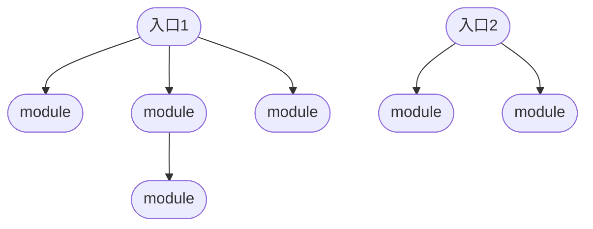

# 资源的输入输出

## 资源的处理流程



最终一个依赖书会被打包为一个bundle，通常来说一个entry对应多个module，打包产出一个bundle。在webpack中一般bundle数量是和entry数量对应的 

## 资源的入口（entry）

### 作用：

1.指定打包入口路径

2.定义入口name

### context

指定资源路径前缀

### entry

字符串类型

```javascript
module.exports = {
    entry:'./src/app.js'
}
```

数组类型

作用是将资源预先合并，打包时最后一个路径作为入口路径

```javascript
module.exports = {
    entry:['react','./src/app.js']
}
//等价于
module.exports = {
    entry:'./src/app.js'
}
//app.js
import 'react'
```

对象类型

配置多入口，必须用对象类型。对象类型的值也可以是字符串或者数组

```javascript
module.exports = {
    entry:{
        a:'./src/a.js',
        b:'./src/b.js'
    }
}
```

函数类型

可以添加一些判断逻辑，只需要返回上述三种类型之一即可
